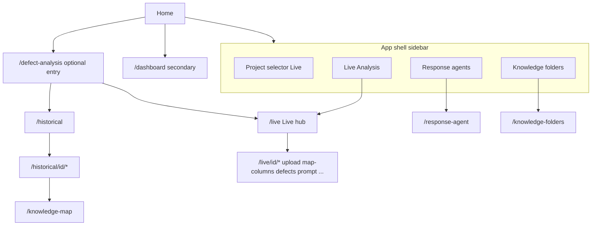

# PCDI platform PRD (draft for screenshots)

Use this document as-is or split each **Feature** into its own doc section. Replace every `[Screenshot: …]` with your image.

---

## 1. Document control

| Field | Value |
|-------|--------|
| Product | **PCDI** — Post-Completion Defects Intelligence |
| Stack (context) | Next.js 15 app in [`app/`](../app/), shell in [`components/layout/app-shell.tsx`](../components/layout/app-shell.tsx), primary nav in [`components/layout/nav-config.ts`](../components/layout/nav-config.ts) |
| Primary backend | Billie analysis APIs (proxied under `/api/defect-projects`, `/api/defect-files`, etc.) |

---

## 2. Vision and goals

**Problem:** Teams need to work from defect registers and spreadsheets—exploring categories, aligning knowledge, and (for live projects) driving AI-assisted response strategy—without losing traceability to source files and project metadata.

**Goals:**

- Unify **live** (Billie-backed defect projects and analyses) and **historical** (register-centric, discovery/knowledge-map workflows) in one product shell.
- Give users a **single place** to pick a live project, run analyses, configure **response agents** and **knowledge folders**, and open visualisations.
- Surface **portfolio-level** counts (projects, analyses, defect items, responses) on the home screen where possible.

**Non-goals (current codebase signals):**

- The **Dashboard** ([`app/dashboard/page.tsx`](../app/dashboard/page.tsx)) describes **mock** stats; treat as demo/secondary unless you productize it.
- **Knowledge map** is framed around **historical discovery** publishing—not the same data path as live Billie rows.

---

## 3. Personas (suggested)

- **Live analyst:** Creates Billie projects, uploads Excel, maps columns, monitors processing, explores category mind graph and defect rows, exports/enriches workbooks.
- **Historical analyst:** Maintains defect registers, discovery categories, and knowledge-map alignment (richer offline/mock flows in UI today).
- **Response / knowledge owner:** Configures agents and document folders scoped to the **selected live project** (sidebar selector).

---

## 4. Information architecture

**Routes worth capturing in screenshots:** `/`, `/live`, `/live/new`, `/live/[projectId]/upload`, `/live/[projectId]/map-columns`, `/live/[projectId]/defects`, `/live/[projectId]/prompt`, `/historical`, `/historical/[projectId]/defects`, `/historical/[projectId]/discovery`, `/response-agent`, `/knowledge-folders`, `/defect-analysis`, `/knowledge-map`, `/dashboard` (if included).

---

## 5. Global UX and chrome

### Feature G1 — App shell and navigation

**User story:** As any user, I always see product identity, live project context, and primary destinations.

**Scope:** Sticky sidebar (md+), mobile top nav, links from [`components/layout/nav-config.ts`](../components/layout/nav-config.ts): Live Analysis, Response agents, Knowledge folders. [`components/layout/project-selector.tsx`](../components/layout/project-selector.tsx) for **live** projects only.

**Acceptance notes:**

- Branding: “PCDI” + subtitle visible in sidebar.
- Project selector lists live projects and supports create flow (dialog).
- Main content scrolls in the right column without blowing out the layout (`minmax(0,1fr)` grid).

`[Screenshot: Desktop — full shell with sidebar + main content]`  
`[Screenshot: Mobile — header chip nav + content]`

---

## 6. Home and portfolio overview

### Feature H1 — Home overview stats

**User story:** As a stakeholder, I see how many projects, analyses, defect items, and responses the connected environment is tracking.

**Scope:** [`app/page.tsx`](../app/page.tsx) + [`components/pcdi/home-overview-stats.tsx`](../components/pcdi/home-overview-stats.tsx); data from [`app/api/live-overview-stats/route.ts`](../app/api/live-overview-stats/route.ts) (aggregates Billie list/detail where configured).

**Acceptance notes:**

- Stat cards with rings and large numbers; error/empty states if API unavailable.
- Entry to create live project when `embedCreateProjectDialog` is enabled.

`[Screenshot: Home — four stat tiles + hero/links]`  
`[Screenshot: Home — error or loading state if relevant]`

---

## 7. Live analysis (Billie-backed)

### Feature L1 — Live hub (project + analyses)

**User story:** As a live analyst, I pick a project, see all **analyses** (defect files), create a new one, open one in the visualisation, and delete a project or a single analysis.

**Scope:** [`app/live/page.tsx`](../app/live/page.tsx) → [`components/pcdi/live-analyses-hub.tsx`](../components/pcdi/live-analyses-hub.tsx); sync via [`lib/pcdi/sync-live-projects-from-api.ts`](../lib/pcdi/sync-live-projects-from-api.ts); lists from `/api/defect-files?projectId=…`.

**Acceptance notes:**

- “Create analysis” → upload route for selected project.
- Table: analysis name, defect file id (sm+), status (Ready / Processing / Failed), Open link to defects view with `defectFile` query.
- Delete project and row-level “more” menu → delete analysis (proxied DELETEs).

`[Screenshot: Live hub — project header + analyses table]`  
`[Screenshot: Row actions menu open — Delete analysis]`  
`[Screenshot: Delete project control visible]`

### Feature L2 — Create live project

**User story:** As a live analyst, I create a Billie defect project without leaving the app.

**Scope:** [`components/pcdi/create-live-project-dialog.tsx`](../components/pcdi/create-live-project-dialog.tsx), [`app/live/new/page.tsx`](../app/live/new/page.tsx) + [`components/pcdi/project-setup-single-page.tsx`](../components/pcdi/project-setup-single-page.tsx) (`POST /api/defect-projects`).

`[Screenshot: Create project dialog — empty form]`  
`[Screenshot: Create project — validation or success path]`

### Feature L3 — Project metadata (setup)

**User story:** As a live analyst, I edit project metadata after creation.

**Scope:** `/live/[projectId]/setup` → [`components/pcdi/project-setup-single-page.tsx`](../components/pcdi/project-setup-single-page.tsx) (steps 1–2, metadata form).

`[Screenshot: Live project setup — metadata fields]`

### Feature L4 — Upload / ingest

**User story:** As a live analyst, I upload the Excel workbook for an analysis.

**Scope:** `/live/[projectId]/upload` → [`components/pcdi/project-ingest-upload-page.tsx`](../components/pcdi/project-ingest-upload-page.tsx).

`[Screenshot: Upload page — file picker and instructions]`

### Feature L5 — Column mapping and analyse trigger

**User story:** As a live analyst, I map spreadsheet columns to Billie fields and kick off analysis.

**Scope:** `/live/[projectId]/map-columns` → [`components/pcdi/column-mapper.tsx`](../components/pcdi/column-mapper.tsx); status polling `/api/defect-files/[id]/status`; analyse `POST /api/defect-files/analyze`.

`[Screenshot: Column mapper — grid / mapping UI]`  
`[Screenshot: Processing or success state]`

### Feature L6 — Live defects visualisation (mind graph + register)

**User story:** As a live analyst, I explore defect categories as a graph and inspect rows for one defect file.

**Scope:** `/live/[projectId]/defects` → [`components/pcdi/live-data-visualisation-draft.tsx`](../components/pcdi/live-data-visualisation-draft.tsx), D3 mind graph [`components/pcdi/connectivity-mind-graph-d3.tsx`](../components/pcdi/connectivity-mind-graph-d3.tsx), sidebar/register pieces; hydration [`lib/pcdi/hydrate-billie-session-from-defect-file.ts`](../lib/pcdi/hydrate-billie-session-from-defect-file.ts); optional `?defectFile=` from hub “Open”.

`[Screenshot: Live defects — graph + sidebar overview]`  
`[Screenshot: Selected category / row detail if applicable]`

### Feature L7 — Master prompt / export path (live)

**User story:** As a live analyst, I copy prompts or continue the export-oriented workflow described in product copy.

**Scope:** `/live/[projectId]/prompt` → [`components/pcdi/defect-analysis-prompt-view.tsx`](../components/pcdi/defect-analysis-prompt-view.tsx) (verify exact UX when capturing).

`[Screenshot: Live prompt page]`

### Feature L8 — Optional live routes

Capture if you document full flow: `metadata`, `data-visualisation` under `app/live/[projectId]/`.

---

## 8. Historical analysis (register-centric)

### Feature R1 — Historical projects list

**User story:** As a historical analyst, I browse local/persisted historical projects and open one.

**Scope:** [`app/historical/page.tsx`](../app/historical/page.tsx) → [`components/pcdi/analysis-projects-view.tsx`](../components/pcdi/analysis-projects-view.tsx) with `module="historical"`.

`[Screenshot: Historical projects table]`

### Feature R2 — Historical project journey

**User story:** As a historical analyst, I upload, set metadata, map columns, view defects register, and run discovery.

**Scope:** Routes under `app/historical/[projectId]/` — `upload`, `setup`, `metadata`, `map-columns`, `defects`, `discovery` (see [`components/pcdi/defects-register-view.tsx`](../components/pcdi/defects-register-view.tsx) for register vs live branching).

`[Screenshot: Historical upload]`  
`[Screenshot: Historical defects register]`  
`[Screenshot: Historical discovery]`

---

## 9. Cross-cutting entry and knowledge map

### Feature X1 — Defect analysis hub (module picker)

**User story:** As a new user, I choose historical vs live from a marketing-style hub.

**Scope:** [`app/defect-analysis/page.tsx`](../app/defect-analysis/page.tsx).

`[Screenshot: Defect analysis hub — two cards]`

### Feature X2 — Knowledge map

**User story:** As a historical user, I see published defect/response/reference connectivity and interact with the graph.

**Scope:** [`app/knowledge-map/page.tsx`](../app/knowledge-map/page.tsx), [`components/pcdi/knowledge-map-canvas-section.tsx`](../components/pcdi/knowledge-map-canvas-section.tsx).

`[Screenshot: Knowledge map — full canvas + legend]`

### Feature X3 — Dashboard (optional / internal)

**User story:** As a demo viewer, I see a snapshot of mock connectivity and inventory.

**Scope:** [`app/dashboard/page.tsx`](../app/dashboard/page.tsx).

`[Screenshot: Dashboard stats]` — label clearly as **mock** if publishing externally.

---

## 10. Response agents and knowledge folders

### Feature A1 — Response strategy agents

**User story:** As a response owner, I define agents (strategy, prompt, linked knowledge folder) for the **selected live project**.

**Scope:** [`app/response-agent/page.tsx`](../app/response-agent/page.tsx) → [`components/pcdi/response-agents-view.tsx`](../components/pcdi/response-agents-view.tsx); store [`lib/pcdi/response-agents-store.ts`](../lib/pcdi/response-agents-store.ts).

`[Screenshot: Agents list + create form]`  
`[Screenshot: Agent row / edit state]`

### Feature A2 — Knowledge folders

**User story:** As a knowledge owner, I create folders and attach PDFs / SharePoint references for the selected project.

**Scope:** [`app/knowledge-folders/page.tsx`](../app/knowledge-folders/page.tsx) → [`components/pcdi/knowledge-folders-view.tsx`](../components/pcdi/knowledge-folders-view.tsx).

`[Screenshot: Folders list]`  
`[Screenshot: Folder detail / upload UI]`

---

## 11. Integrations and constraints (for PRD appendix)

- **Auth / tenancy:** Document as TBD unless your deployment adds auth; current UI assumes trusted browser + API keys server-side (`BILLIE_API_KEY`, `BILLIE_API_BASE`).
- **Live vs persisted projects:** Live list is API-sourced with selective local merge (see [`lib/pcdi/projects-store.ts`](../lib/pcdi/projects-store.ts)); historical projects persist in browser storage — state in PRD if customer-facing.
- **Deletion:** Project delete cascades on server (per your API doc); UI triggers proxied DELETE (`app/api/defect-projects/[projectId]/route.ts`, `app/api/defect-files/[defectFileId]/route.ts`).

---

## 12. Suggested screenshot checklist (printable)

Ordered walkthrough for a single “happy path” gallery:

1. Shell + empty or populated home  
2. Live hub with one project + analyses  
3. Create project dialog  
4. Upload → column map → status  
5. Live defects graph  
6. Response agents + knowledge folders (same selected project)  
7. Defect analysis hub + historical list + one historical defects screen  
8. Knowledge map  
9. (Optional) Dashboard labelled mock  

---

## Using this file elsewhere

To paste into Notion, Confluence, or Google Docs: copy sections **5–11** (or the full document) from this file and insert images where each `[Screenshot: …]` line appears. Relative links to source files may need to be removed or rewritten for your wiki.
