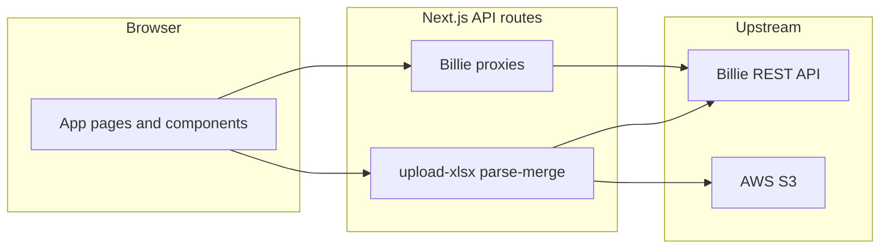

# UI interactions and backend APIs

This document describes how the **pcdi-ui** Next.js app talks to **Billie** (analysis backend), **AWS S3** (upload), and local parsers. Billie response bodies for many GET routes are **passed through** unchanged; field shapes are not fully specified here—use upstream docs plus [`lib/pcdi/extract-backend-columns.ts`](../lib/pcdi/extract-backend-columns.ts) and [`lib/pcdi/defect-project-api-map.ts`](../lib/pcdi/defect-project-api-map.ts) for normalization.

## Architecture

Next.js **Route Handlers** under `app/api/` either:

- **Proxy** to Billie at `BILLIE_API_BASE` with optional `Authorization: Bearer <BILLIE_API_KEY>`, or  
- **Execute locally**: S3 upload (`upload-xlsx`), merged spreadsheet download + parse (`parse-merge`).

**Passthrough routes** (success body = Billie JSON as-is):

- `GET /api/defect-files?projectId=…`
- `GET /api/defect-files/:defectFileId`
- `GET /api/defect-files/:defectFileId/status`

Envelope shapes vary (`result`, arrays, etc.). Use extractors in `lib/pcdi/extract-backend-columns.ts` for IDs and column lists.

## Environment variables

| Variable | Effect |
|----------|--------|
| `BILLIE_API_BASE` | Billie origin (trailing slash stripped). Default in code: `https://billie-alb-dev-s3.wonderbricks.com:6070`. |
| `BILLIE_API_KEY` | If set, sent as `Authorization: Bearer …` on Billie proxy requests. |
| `BILLIE_SKIP_BACKEND_HANDOFF` | When `1`, Billie **GET** proxies return **503** `{ error: "Backend handoff disabled." }`. Also affects `POST /api/defect-files/analyze` (503). **`POST /api/save-excel-content`** returns `{ ok: true, skipped: true }` without calling Billie. |
| `BILLIE_SKIP_DEFECT_PROJECT_CREATE` | When `1`, **`POST /api/defect-projects`** returns **200** `{ ok: true, id: <UUID>, skipped: true }` without calling Billie. |
| AWS credentials / `AWS_S3_BUCKET`, `AWS_REGION`, etc. | Required for **`POST /api/upload-xlsx`** (see route errors for missing config). |

## API routes (Next.js → client contract)

### `GET /api/defect-projects`

| | |
|---|---|
| **Upstream** | `GET {BILLIE_API_BASE}/api/defect-projects` |
| **Query** | None |
| **Success (200)** | `{ ok: true, projects }` — `projects` is normalized for the UI via `mapDefectProjectsResponseToHistorical` (see [`defect-project-api-map.ts`](../lib/pcdi/defect-project-api-map.ts)). |
| **Errors** | **503** if handoff skipped. **502** `{ error, detail? }` if Billie non-OK or network failure. |

### `POST /api/defect-projects`

| | |
|---|---|
| **Upstream** | `POST {BILLIE_API_BASE}/api/defect-projects` |
| **Body** | JSON forwarded as-is. UI commonly sends: `name`, `code`, `location`, `region`, `floorLevels`, `structureTypes` (array), `assetType` (see [`project-setup-single-page.tsx`](../components/pcdi/project-setup-single-page.tsx)). |
| **Success (200)** | `{ ok: true, id: string, data }` — `id` is extracted from Billie response; `data` is raw parsed upstream body. |
| **Skipped (200)** | If `BILLIE_SKIP_DEFECT_PROJECT_CREATE=1`: `{ ok: true, id: <UUID>, skipped: true }`. |
| **Errors** | **400** invalid JSON. **502** `{ error, detail? }` if Billie error or missing `id` in response. |

### `GET /api/defect-projects/:projectId`

| | |
|---|---|
| **Upstream** | `GET {BILLIE_API_BASE}/api/defect-projects/:projectId` |
| **Path** | `projectId` required (non-empty after trim). |
| **Success (200)** | `{ ok: true, project, detail }` — `project` normalized via `mapDefectProjectRowToHistorical`; `detail` is raw Billie payload. |
| **Errors** | **400** missing id. **503** handoff skipped. **502** `{ error, status?, detail? }`. |

### `GET /api/defect-files`

| | |
|---|---|
| **Upstream** | `GET {BILLIE_API_BASE}/api/defect-files?projectId=…` |
| **Query** | **`projectId`** (required). |
| **Success (200)** | Billie JSON **unchanged** (passthrough). |
| **Errors** | **400** missing `projectId`. **503** handoff skipped. **502** `{ error, status?, detail? }`. |

### `GET /api/defect-files/:defectFileId`

| | |
|---|---|
| **Upstream** | `GET {BILLIE_API_BASE}/api/defect-files/:id` |
| **Path** | `defectFileId` required. |
| **Success (200)** | Billie JSON **unchanged** (passthrough). |
| **Errors** | **400** missing id. **503** handoff skipped. **502** `{ error, status?, detail? }`. |

### `GET /api/defect-files/:defectFileId/status`

| | |
|---|---|
| **Upstream** | `GET {BILLIE_API_BASE}/api/defect-files/:id/status` |
| **Path** | `defectFileId` required. |
| **Success (200)** | Billie JSON **unchanged**. Client polling expects shapes such as `result.isProcessed`, `result.mergeFileUrl`, `result.mergeFileName` (see [`column-mapper.tsx`](../components/pcdi/column-mapper.tsx)). |
| **Errors** | **400** missing id. **503** handoff skipped. **502** `{ error, status?, detail? }`. |

### `POST /api/defect-files/analyze`

| | |
|---|---|
| **Upstream** | `POST {BILLIE_API_BASE}/api/defect-files/analyze` |
| **Body (JSON)** | `{ defectFileId: string, headersToMerge: string[] }` — non-empty string array after trimming empty entries. |
| **Success (200)** | `{ ok: true, data }` — `data` is parsed Billie response body. |
| **Errors** | **400** invalid JSON, missing `defectFileId`, or invalid / empty `headersToMerge`. **503** handoff skipped. **502** `{ error, status?, detail? }`. |

### `POST /api/defect-files/parse-merge`

| | |
|---|---|
| **Upstream** | None (server **GET**s `mergeFileUrl`, parses XLSX with [`parseBillieMergeXlsxBuffer`](../lib/pcdi/parse-billie-merge-xlsx.ts)). |
| **Body (JSON)** | `{ projectId: string, mergeFileUrl: string }` — `mergeFileUrl` must be `http:` or `https:`. |
| **Success (200)** | `{ ok: true, rows }` — `rows`: [`HistoricalDefectTableRow`](../lib/pcdi/types.ts)[]. |
| **Errors** | **400** invalid JSON, missing fields, or invalid URL. **502** download or parse failure (`error` message varies). |

### `POST /api/upload-xlsx`

| | |
|---|---|
| **Upstream** | AWS S3 (`putXlsxToS3`) + presigned GET URL. |
| **Body** | **`multipart/form-data`**: `file` (.xlsx), `projectId` (string), `headerRow` (string, **1-based** row index, **1–1000**). Max file size **30MB**. |
| **Success (200)** | `{ ok: true, fileUrl, headerRow, presignedUrlExpiresInSeconds, bucket, key, region }`. |
| **Errors** | **400** missing fields / invalid `headerRow`. **413** file too large. **415** not `.xlsx`. **500** / **503** S3 configuration or AWS errors (see route for message patterns). |

### `POST /api/save-excel-content`

| | |
|---|---|
| **Upstream** | `POST {BILLIE_API_BASE}/api/defect-files/saveExcelContent` |
| **Body (JSON)** | `{ projectId: string, fileUrl: string, headerNum: number }` — `fileUrl` http(s); `headerNum` positive integer (same semantics as upload header row). |
| **Success (200)** | `{ ok: true, data }` — `data` parsed Billie body. If **`BILLIE_SKIP_BACKEND_HANDOFF=1`**: `{ ok: true, skipped: true }` (**no** `data`). |
| **Errors** | **400** validation. **502** Billie error. |

---

## UI flows → API sequences

| UI area | Primary components | Network sequence |
|---------|-------------------|------------------|
| Live project list | [`analysis-projects-view.tsx`](../components/pcdi/analysis-projects-view.tsx) | `GET /api/defect-projects` |
| Live viz / project chrome | [`live-data-visualisation-draft.tsx`](../components/pcdi/live-data-visualisation-draft.tsx) | `GET /api/defect-projects`, optional `GET /api/defect-projects/:projectId` |
| Create live project | [`project-setup-single-page.tsx`](../components/pcdi/project-setup-single-page.tsx) | `POST /api/defect-projects` → navigate to upload |
| Upload + register file | [`historical-upload-panel.tsx`](../components/pcdi/historical-upload-panel.tsx) | `POST /api/upload-xlsx` → `POST /api/save-excel-content`; headers/columns parsed in browser; `defectFileId` from handoff via [`extract-backend-columns.ts`](../lib/pcdi/extract-backend-columns.ts) |
| Column mapper (analyze + merge) | [`column-mapper.tsx`](../components/pcdi/column-mapper.tsx) | `POST /api/defect-files/analyze` → poll `GET /api/defect-files/:id/status` until success → `POST /api/defect-files/parse-merge` → writes merge session (below) |
| Hydrate register on open | [`hydrate-billie-session-from-defect-file.ts`](../lib/pcdi/hydrate-billie-session-from-defect-file.ts) | `GET /api/defect-files?projectId=` → `GET /api/defect-files/:id`; if rows only in merge file, `POST /api/defect-files/parse-merge` |

## Client-only session storage (`sessionStorage`)

These are **not** REST APIs; keys are per `projectId` where applicable.

| Key pattern | Module | Purpose |
|-------------|--------|---------|
| `pcdi-billie-merge-{projectId}` | [`billie-merge-session.ts`](../lib/pcdi/billie-merge-session.ts) | Parsed defect rows, `defectFileId`, merge file URL/name, row signature |
| `pcdi-upload-{projectId}` | [`upload-session.ts`](../lib/pcdi/upload-session.ts) | Upload metadata: columns, file name, header row, optional data rows |
| `pcdi-map-{projectId}` | [`map-session.ts`](../lib/pcdi/map-session.ts) | Column → AI target mapping for historical/live mapper |
| `pcdi-live-analysis-{projectId}` | [`live-selection-session.ts`](../lib/pcdi/live-selection-session.ts) | Per-row response strategy selections + fingerprint |

## Row type for parsed data

[`HistoricalDefectTableRow`](../lib/pcdi/types.ts) is the stable shape for rows returned by **`POST /api/defect-files/parse-merge`** and for rows extracted from Billie JSON via [`extractHistoricalRowsFromDefectFilePayload`](../lib/pcdi/defect-file-merge-info.ts). Optional fields include `aiSuggestedStrategies`, `responseStrategyTaxonomy`, `extractedDocCitations`.

Billie GET responses used only as envelopes for extraction are intentionally **not** fully typed in this repository.
